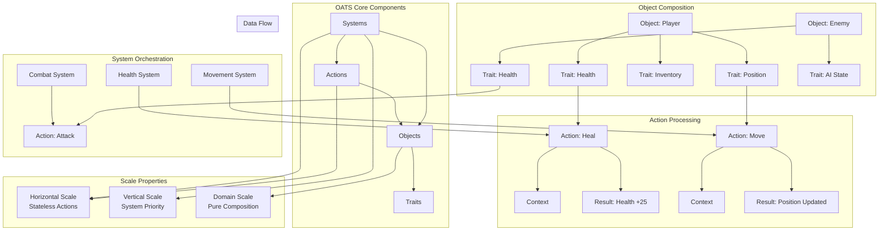

# OATS Architecture

## Overview

OATS (Objects • Actions • Traits • Systems) is a universal architecture pattern for infinite scale across any domain.

## Architecture Diagram

## Core Principles

### 1. **Objects** - Identity Containers
- Pure composition of traits
- No behavior pollution
- Maximum modularity
- Unique identity with UUID

### 2. **Traits** - Immutable Domain State
- Single source of truth
- Auditable state management
- Type-safe data access
- Versioned for change tracking

### 3. **Actions** - Stateless Business Logic
- Horizontally scalable
- Domain-independent processing
- Pure functions with context
- Return updates, not side effects

### 4. **Systems** - Operational Orchestration
- Resource allocation
- Priority management
- Cross-domain coordination
- Performance monitoring

## Benefits

- **Resource Optimization**: Systems prioritize compute allocation
- **Infinite Horizontal Scale**: Stateless actions distribute across infrastructure
- **Technical Debt Prevention**: Pure separation eliminates circular dependencies
- **Operational Intelligence**: Maps directly to measurable business outcomes

## Universal Scaling Properties

This pattern runs the foundational infrastructure behind every platform that achieved global scale without architectural rewrites. From AWS to Unity, from Kubernetes to financial trading systems - OATS abstractions create operational superiority that compounds across any domain. 